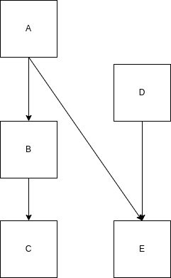

Outpack includes a query DSL (domain specific language), extending the one used by orderly (see [`orderly1::orderly_search()`](https://www.vaccineimpact.org/orderly/reference/orderly_search.html)).

Queries are used in identifying ids to pull in as dependencies, so rather than providing an identifier, you might want to depend on

* the most recent copy of a packet with a particular name
* ...produced in some date range
* ...with some particular set of parameter values
* ...that produced a particular file
* ...that was depended on by some other packet

Not all of this is supported as of the current version of `orderly2`, and *using* the queries seamlessly is also not supported!

## Structure of queries

The most simple query is

```r
latest()
```

which finds the most recent packet; this is unlikely to be very useful without scoping - see below.

More complex queries are expressed in a syntax that is valid R (this is also valid Julia and close to valid Python).  A complex query is composed of "tests"

```r
name == "some_name"
parameter:x > 1
```

Every "test" uses a boolean operator (`<`, `>`, `<=`, `>=`, `==`, or `!=`) and the left and right hand side can be one of:

* a lookup into the outpack metadata (`parameter:x` is the value of a parameter called `x`, `name` is the name of the packet, and `id` is the id of a packet)
* a lookup into the provided data `pars` (`this:x` is the value of `pars$x`)
* a literal value (e.g., `"some_name"`, `1`, or `TRUE`)

Tests can be grouped together `(`, `!`, `&&`, and `||` as you might expect:

* `parameter:x == 1 || parameter:x == 2` finds packets where the parameter `x` was 1 or 2
* `name == "data" && parameter:x > 3` finds packets called "data" where parameter `x` is greater than 3
* `(parameter:y == 2) && !(parameter:x == 1 || parameter:x == 2)` finds where parameter `y` is 2 and parameter `x` is anything other than 1 or 2 (could also be written `(parameter:y == 2) && (parameter:x != 1 && parameter:x != 2)`)

There are four other functions

* `latest(expr)` finds the latest packet satifying `expr` - it always returns a length 1 character, but this is `NA_character_` if no suitable packet is found. If no `expr` is given then the latest of all packets is returned.
* `single(expr)` is like `latest(expr)` except that it is an error if `expr` does not evaluate to exactly one packet id
* `usedby(expr, FALSE)` where `expr` is either a literal `id` or an expression which returns 1 `id`. This finds all packets which were used in generation of packet with `id` returned from `expr` (see dependencies section for more details).

## Special simple queries

There are two shorthand queries:

* `latest` is equivalent to `latest()` (most useful when applied with a scope)
* a string matching the regular expression for an id (`^([0-9]{8}-[0-9]{6}-[[:xdigit:]]{8})$`) is equivalent to `single(id == "<id>")` where `"<id>"` is the string provided)

## Scoping queries

**WARNING: we may remove this**

Scoping queries can be used as a shorthand for filtering the returned packets. In the future they could be used to reduce the set of packets that are searched over to speed up query evaluation. They join together with the main query as `(scope) && (expr)`, except when the `expr` is a call to `latest` or `single`. In this case they combine as `latest((scope) && (expr))` or `single((scope) && (expr))`. This is useful if you want to limit the search to a particular name or location but perform some more detailed search.

For example, the query

```r
outpack_query(quote(parameter:x == 1), scope = quote(name == "data"))
```

is equivalent to

```r
outpack_query(quote(parameter:x == 1 && name == "data"))
```

`orderly2` uses this functionality when resolving dependencies with `orderly2::orderly_dependency`.

### Scoping on name

Very often users will want to scope by name so instead of passing `scope` argument there is a shorthand `name` argument for usability.

```r
outpack_query(quote(parameter:x == 1), name = "data")
```

Which is the equivalent of

```r
outpack_query(quote(parameter:x == 1), scope = quote(name == "data"))
```

## Dependencies

If we have 2 packets, where B depends on output from A (i.e. we call `outpack_packet_use_dependency(id_a, ...)` when running packet B) we can draw this as.

```{r, echo = FALSE, fig.align = 'center'}
knitr::include_graphics("images/dependency_terminology.png")
```

We could equivalently say

* A is a dependency of B, B depends on A
* A is used by B , B uses A
* A is a parent of B, B is a child of A

With the tree of dependencies built by outpack we might want to search for packets which have been used by another packet. We can use the query function `usedby(id)` to list all packets which are used by `id`. This will search recursively through all packets used by `id` and its parents and its parents parents and so on.

The optional second arg `immedate` is `FALSE` by default, if set to `TRUE` then we search only for immediate (e.g. level 1) dependencies.

Being able to search through dependencies like this means if we have some packet structure like

```{r, echo = FALSE, fig.align = 'center'}
knitr::include_graphics("images/dependency_recursive.png")
```

and we want to know the `id` of `A` which was used by `C` we can find this using `outpack_search`

```r
outpack_search(quote(usedby(latest(name == "C"))), name = "A")
```

`usedby` can be combined with groupings and scope:

```r
outpack_search(quote(usedby(latest(name == "C")) && parameter:year == 2022),
               name = "A")
```

The depth that `usedby` will recuse can be controlled by setting the `depth` e.g.

```r
outpack_search(quote(usedby(latest(name == "C"), depth = 1)), name = "A")
```

will search for just immediate parents of `C`. `depth` can be any positive integer, by default `depth` will recurse until it finds all parents.

`usedby` can be simplified by using subqueries. Subqueries are denoted by curly braces `{}` and can either be named and passed in `subquery` arg or can be anonymous. The query below is equivalent to the above but uses a subquery for `C`.

```r
outpack_search(quote(usedby({C}) && parameter:year == 2022),
               name = "A",
               subquery = list(C = quote(latest(name == "C"))))
```

There are two important things to note about `usedby`:
* The query inside `usedby` will search the entire index, ignoring any `scope` or `name` parameters. This is because we want to find all packets which are used by `latest` `C`. If the subquery `C` was scoped this would return no results.
* The query inside `usedby` must return a single result. To ensure this it must either be a literal `id`, a call to `latest` or a call to `single`

As well as searching up the dependency tree using `usedby` we can search down with the `uses` function. In the same setup above with reports `A`, `B` and `C` if we want to know the `id` of `C` which uses `A` we can find this by using

```r
outpack_search(quote(uses(latest(name == "A"))),
               name = "C")
```

`uses` and `useby` can be combined to search more complex arrangements of dependencies. If we have something like

```{r, echo = FALSE, fig.align = 'center'}

```

If we want to search for the version of `E` which depends on the version of `A` which was used in the latest `C` we can do this via

```
outpack_search(
  quote(latest(uses(single(usedby(latest(name == "C")) && name == "A")))),
  name = "E")
```

This searches up the tree from `C` to `A` and then down the tree to find the version of `E`. Note that is is important we added the `name == "A"` condition here, if that was missing `usedby(latest(name == "C"))` would also return `B` and `single` would throw an error because we have multiple packets.

We can also search up the tree and then down to find `A` from `D` e.g.

```
outpack_query(
  quote(usedby(single(uses(name == "D")))),
  name = "A",
  root = root)
```

note as `E` is the only packet which uses `D` we do not need to add a `name == "E"` clause.

We can combine `usedby` and `uses` in more complex searches, such as to find `D` from `C` we could run

```
outpack_query(
  quote(usedby(single(uses(single(usedby(latest(name == "C")) && name == "A"))) && name == "E"))),
  name = "D",
  root = root)
```

## Possible future queries and interface improvements

### Simple things

`orderly1` supports `is.null(parameter:x)` but we might generalise this and support

```r
parameter:x == NULL
```

However, in Python we have `None` and in Julia `nothing`, so this complicates things. Alternatively we could use `missing(parameter:x)`?

### Explain the query

Often, people want to know "why does this packet not match"?  It would be good to show where in the query some set of packets fail the query and are excluded. This would definitely be its own bit of work.
